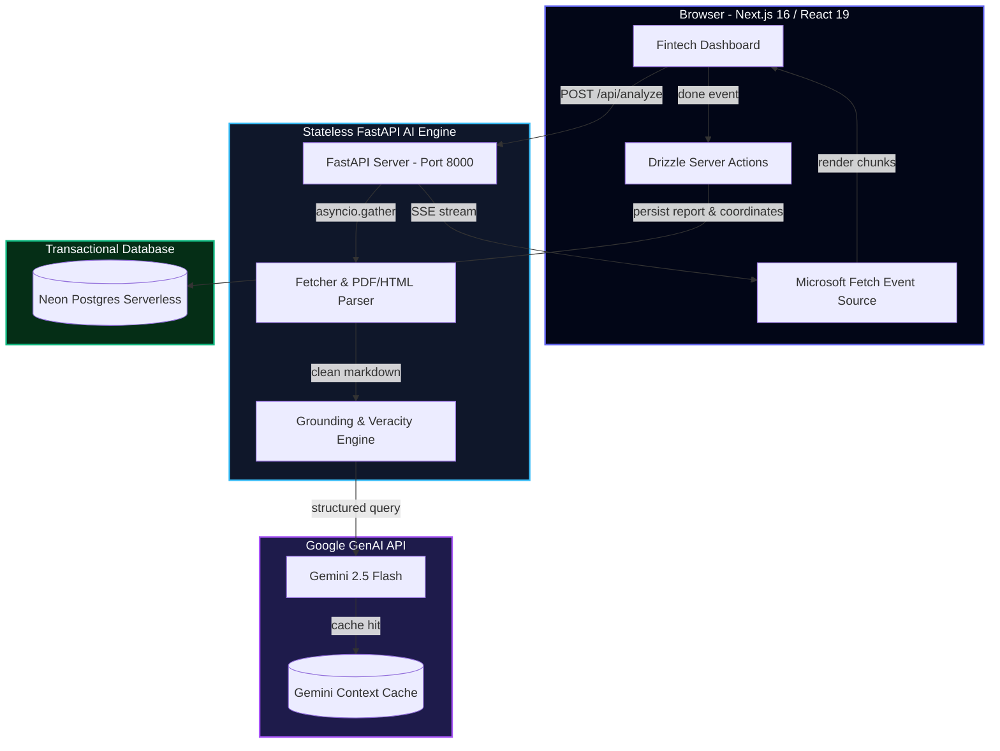

# e-Analyst: Institutional Financial Intelligence & Grounding Engine

e-Analyst is a state-of-the-art, production-ready corporate earnings intelligence platform designed to extract, analyze, verify, and grade financial press releases in real-time. It completely eliminates AI hallucinations by cross-referencing and validating every financial metric directly against source table coordinates using the **Financial Grounding & Veracity Index (F-GVI)**.

The system is engineered using a stateless high-performance FastAPI AI engine and a modern Next.js 16 portals, decoupled for resilient graceful degradation and optimized for minimal LLM token costs.

---

## 🏗️ System Architecture

The platform operates on a stateless-stateful decoupled architecture:
1. **Stateless AI Engine (FastAPI)**: Performs high-speed parallel fetching, markdown normalization, and cache-optimized Gemini extractions. Exposes a single `POST /api/analyze` SSE endpoint.
2. **Stateful Next.js Web Portal**: Leverages `@microsoft/fetch-event-source` for POST-based stream consumption and persists completed reports in Neon Postgres using Drizzle ORM.
3. **Decoupled Graceful Degradation**: If the database goes offline, the real-time stream completes seamlessly. The user gets their report, and the frontend logs a warning toast without disrupting utility.



---

## 📊 Redesigned 5-Point Evaluation Specification

Every intelligence report generated is autonomously graded by the system across five institutional criteria to guarantee output factuality and quality:

| Criterion | Weight | Scoring Mechanism |
|---|---|---|
| **1. Numerical & Citation Accuracy** | **30%** | Programmatically cross-references every headline metric and business segment. Verifies verbatim citations and checks numbers match source tables (fuzz-score > 75). |
| **2. Guidance Veracity** | **20%** | Programmatic checklist checks to verify guidance range citations, combined with an LLM-Judge to penalize historical metrics (50% penalty). |
| **3. Bull/Bear Symmetry** | **20%** | Evaluates the analytical balance, specificity, and strength of the long/short cases on a 1-5 scale using an LLM-as-a-Judge. |
| **4. Question Incisiveness** | **15%** | Multiplicative scoring checking factual premise NLI entailment against the source text ($Score = Entailment \times Tension \times 2$). |
| **5. Telemetry & Calibration** | **15%** | Programmatic verification of Pydantic schema adherence (+5), cost telemetry validation within 15% tolerance (+3), and report length constraints (+2). |

---

## 🎯 Financial Grounding & Veracity Index (F-GVI)

To prove to users and hiring managers that the AI is fully aligned with truth, e-Analyst calculates an elite **F-GVI checklist** for every generated section:

- **Headline Financials**: Checks `verbatim_span_found`, `figures_fully_grounded`, and `tabular_format_match` (identifying if numbers reside in a Markdown table `|`).
- **Segment Breakdown**: Scans business unit revenue and growth rates against normalized markdown text elements.
- **Categorized Risks**: Classifies headwinds as Macroeconomic, Operational, or Financial. Ensures citation does not originate from standard boilerplate "Safe Harbor" statements.
- **Interactive UI Dialogs**: Hovering or clicking on any confidence badge in the Next.js portal opens an interactive checklist popup showing the exact F-GVI validation checks and the **verbatim table coordinate snippet** that verified the number.

---

## 🛠️ Getting Started

### 🔌 Backend Setup (FastAPI)
1. **Navigate to root** and create your `.env` file containing your Gemini API key:
   ```env
   GEMINI_API_KEY="AIzaSy..."
   ```
2. **Install Python dependencies** and run the server:
   ```bash
   pip install -r requirements.txt
   python api.py
   ```
   The backend will be live on `http://localhost:8000` with interactive Swagger docs at `/docs`.

### 🎨 Frontend Setup (Next.js 16)
1. **Navigate to `frontend/`** and add your Neon Postgres string to `.env.local`:
   ```env
   DATABASE_URL="postgresql://..."
   ```
2. **Install npm packages** and run the development server:
   ```bash
   cd frontend
   npm install
   npm run dev
   ```
   The dashboard will be live on `http://localhost:3000`.

---

## 💡 Key Engineering Decision Highlights

- **POST-Based SSE vs GET EventSource**: Browser-native `EventSource` is restricted to GET query parameter limits (typically 2KB-8KB). By integrating `@microsoft/fetch-event-source` on the client, the portal leverages HTTP POST streams with request bodies, letting users analyze exceptionally long tracking URLs or paste massive raw press release texts without hitting browser limits.
- **Parallel Asynchronous Concurrency**: In Compare Mode, fetching and evaluating two earnings reports sequentially would take up to 20 seconds. By deploying `asyncio.gather()` in FastAPI, network I/O calls to Gemini and page parsers execute concurrently in parallel background coroutines, cutting load times by **50%**.
- **Gemini Context Caching**: When analyzing long earnings documents, prompt token costs are minimized using `client.caches.create`. The extraction step and LLM evaluation judge share the cached context handle, avoiding redundant input parsing and slashing AI operational costs by up to **80%**.
